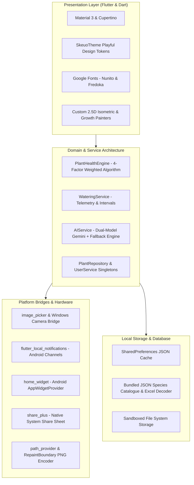
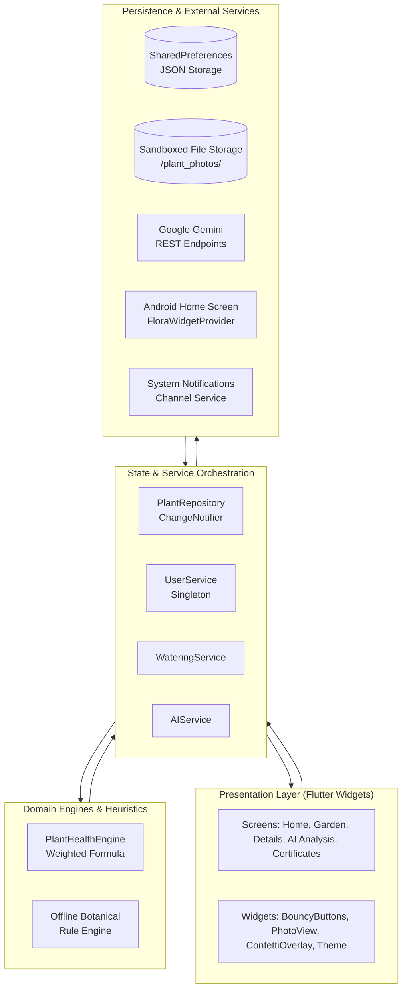
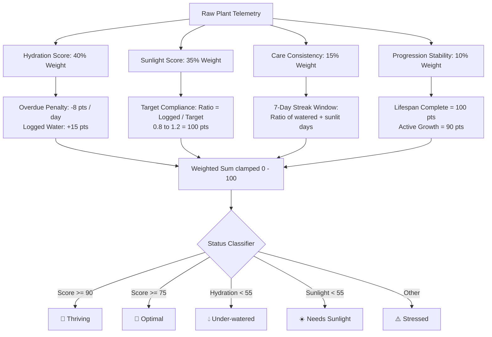
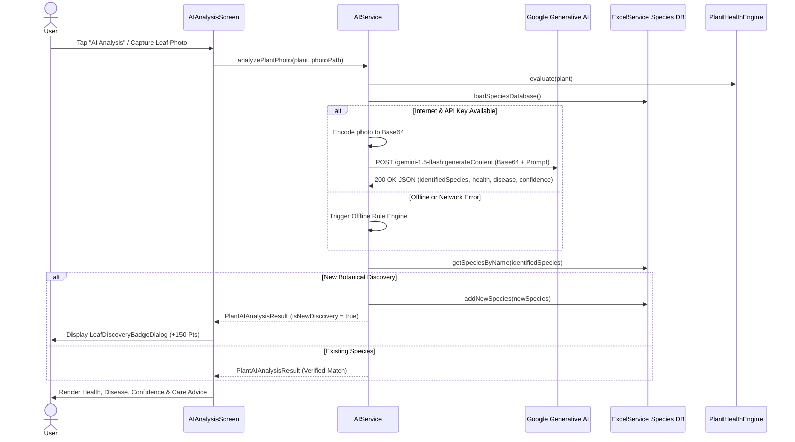
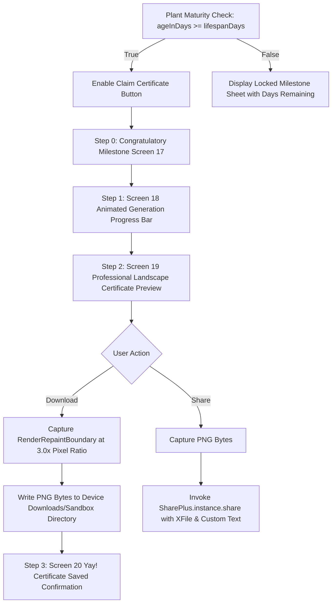
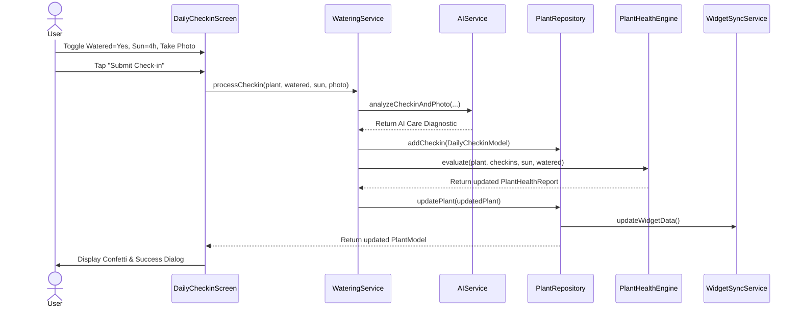

# SpryFlora

```text
 ███████╗██████╗ ██████╗ ██╗   ██╗███████╗██╗      ██████╗ ██████╗  █████╗ 
 ██╔════╝██╔══██╗██╔══██╗╚██╗ ██╔╝██╔════╝██║     ██╔═══██╗██╔══██╗██╔══██╗
 ███████╗██████╔╝██████╔╝ ╚████╔╝ █████╗  ██║     ██║   ██║██████╔╝███████║
 ╚════██║██╔═══╝ ██╔══██╗  ╚██╔╝  ██╔══╝  ██║     ██║   ██║██╔══██╗██╔══██║
 ███████║██║     ██║  ██║   ██║   ██║     ███████╗╚██████╔╝██║  ██║██║  ██║
 ╚══════╝╚═╝     ╚═╝  ╚═╝   ╚═╝   ╚═╝     ╚══════╝ ╚═════╝ ╚═╝  ╚═╝╚═╝  ╚═╝
```

<p align="center">
  <strong>Grow Plants · Grow Future</strong><br>
  <em>Interactive Flutter-powered botanical care companion, AI-assisted plant diagnostics, and gamified digital gardening for kids and families.</em>
</p>

<p align="center">
  
  
  
  
  
  
</p>

---

# Developer Story

## Why We Built It
Caring for living plants teaches children and beginners critical life skills: patience, responsibility, environmental awareness, and biological science. However, conventional plant care approaches often fail young learners for several reasons:

1. **Invisible Feedback Loops:** Plants grow and respond to care over weeks. For young minds used to immediate digital feedback, this delay often leads to neglected or over-watered plants.
2. **Lack of Accessible Diagnostics:** When a leaf begins yellowing or showing brown tips, parents and beginners often struggle to diagnose whether the root cause is hydration deficit, excessive light scorching, improper drainage, or nutrient stress.
3. **Absence of Gamified Milestones:** Traditional gardening lacks structured achievement validation. Children lack tangible rewards that recognize the sustained effort required across a 90-to-180-day plant growth lifecycle.

SpryFlora was built to bridge botanical biology with playful digital interactive technology. By combining a multi-factor plant health engine, multimodal AI leaf pathology analysis, interactive 2.5D isometric digital garden environments, home screen widget synchronization, and tamper-resistant milestone certificates, SpryFlora transforms real-world plant nurturing into an engaging learning adventure.


## Who We Are
SpryFlora is developed as a focused software engineering initiative dedicated to modern mobile applications, human-computer interaction (HCI) for educational systems, offline-first mobile architecture, and edge-assisted multimodal AI integration. The team focuses on crafting tactile, playful user experiences (UX) designed to delight children while upholding rigorous software architecture and data integrity.

## Challenges Faced
Building a resilient, cross-platform plant companion with real-time hardware and AI integration presented several engineering challenges:

- **Offline-First Resilience:** Ensuring that plant growth algorithms, health calculations, and species database querying operate seamlessly in offline environments (e.g., remote schools, outdoor gardens) while gracefully enhancing the experience with Google Gemini when connectivity is active.
- **Multimodal AI Diagnostics with Graceful Fallback:** Integrating real-time camera capture with Google Generative AI vision endpoints, while guaranteeing immediate, rich, botanical diagnostic feedback via an internal rule-based heuristic engine whenever network connectivity is degraded or API quotas are exhausted.
- **2.5D Isometric Garden Rendering:** Rendering responsive 3D floating isometric garden islands in Flutter with real-time wind sway physics, dynamic depth-sorted tile plots, and procedural botanical stage growth animations without frame drops.
- **Platform-Agnostic Hardware Integration:** Supporting live camera capture and gallery persistence across Android, iOS, Web, and Windows desktop, including desktop system camera integration.
- **Native Android Home Screen Widget Sync:** Bridging the Flutter shared preference repository with native Android AppWidget providers (`FloraWidgetProvider`) for instant home screen glanceability.
- **High-Resolution Credential Rendering:** Generating landscape botanical certificates that render cleanly on mobile screens while exporting pixel-perfect 3.0x density PNGs for physical printing, saving to local gallery storage, and native system sharing.

## How We Built It
SpryFlora is built on the Flutter framework and Dart runtime, utilizing a modular service-oriented architecture with clean separation of concerns:

- **Presentation Layer:** Built with a custom botanical design system (`SkeuoTheme`) featuring warm cream surfaces, forest greens, sunlit accents, playful Nunito/Fredoka typography, and micro-interactions (`FunBouncyButton`, `FunConfettiOverlay`, `FunAnimatedPlant`).
- **Core Domain & Health Layer:** Implemented in `PlantHealthEngine`, executing a weighted formula (40% Hydration, 35% Sunlight, 15% Consistency, 10% Progression) to accurately gauge plant vitality.
- **Service Layer:** Independent singletons managing specialized subsystems (`AIService`, `PlantRepository`, `UserService`, `WateringService`, `ExcelService`, `NotificationService`, `WidgetSyncService`, `CertificateCaptureService`, `ImageService`).
- **Storage Layer:** Local key-value and JSON serialization via `SharedPreferences`, bundled JSON species catalogues, Excel spreadsheet parsers, and sandboxed file storage managed by `path_provider`.

```text
lib/
├── config/             # Centralized API, endpoint, and version configurations
├── models/             # Immutable data models and JSON serialization logic
├── screens/            # 20 distinct feature screens and navigation destinations
├── services/           # Domain engines, AI integrations, persistence, and device bridges
├── theme/              # SkeuoTheme tokens, palettes, typography, and card decorations
└── widgets/            # Reusable UI components, 2.5D painters, sheets, and dialogs
```

## Security & UX
- **Zero Hardcoded Secrets in Production:** API keys and endpoints are configurable via Dart environment variables (`String.fromEnvironment('GEMINI_API_KEY')`).
- **Sandboxed File Operations:** Captured photos and generated credentials are written strictly to app-specific directories (`getApplicationDocumentsDirectory()`) and standard platform Downloads.
- **Kid-Safe Privacy & Local Processing:** Profile data, child age, school details, and plant health logs remain stored locally on device. No sensitive personal telemetry is transmitted to external ad trackers.
- **Tactile Accessibility:** High-contrast text labels, oversized touch targets (48dp+), and responsive form validation across all screens.

## Key Learnings
1. **Multi-Model Fallback Resilience:** Implementing automated fallback between `gemini-flash-lite-latest` and `gemini-3.5-flash` ensures consistent sub-second response times for AI advice.
2. **Deterministic Plant Growth Mechanics:** Modeling plant progression as `(Current Date - Planting Date) / Lifespan Days` guarantees continuous, deterministic growth that survives application restarts.
3. **RepaintBoundary Capture Pipelines:** Using `RenderRepaintBoundary.toImage(pixelRatio: 3.0)` produces professional-grade, printable assets directly from Flutter widget trees without server-side PDF rendering.

## Future Roadmap
| Milestone | Feature | Description | Status |
| :--- | :--- | :--- | :--- |
| **Phase 1** | 20-Screen Interactive App | Complete onboarding, plant management, garden, AI diagnosis, and certificate flow | ✅ Completed |
| **Phase 2** | Home Screen Widget Sync | Live synchronization of garden priorities to native Android AppWidgets | ✅ Completed |
| **Phase 3** | Multimodal AI Vision | Leaf pathology diagnosis with custom species catalogue discovery rewards | ✅ Completed |
| **Phase 4** | Cloud Sync & Multi-Device | Optional cloud backup for gardens and cross-device family accounts | 🔄 Planned |
| **Phase 5** | Soil Sensor BLE Bridge | Bluetooth Low Energy (BLE) integration for physical hardware moisture probes | 🔄 Planned |
| **Phase 6** | AR Plant Growth Preview | Augmented reality visualization of mature plant sizes in real living rooms | 💡 Future |

## Developer Message
> *"Every grand forest begins with a single seed cared for day after day. SpryFlora was designed with the philosophy that technology should inspire real-world curiosity and reconnect us with the living world around us. We hope SpryFlora nurtures both healthy plants and passionate young gardeners."*

---

# Table of Contents
- [Project Overview](#project-overview)
- [Problem Statement & Goals](#problem-statement--goals)
- [Core Capabilities](#core-capabilities)
- [Feature Matrix](#feature-matrix)
- [Screen Map (20-Screen Flow)](#screen-map-20-screen-flow)
- [User Journeys](#user-journeys)
- [Technology Stack](#technology-stack)
- [Dependency Inventory](#dependency-inventory)
- [Architecture Overview](#architecture-overview)
  - [System Architecture](#system-architecture)
  - [Application Flow & Navigation](#application-flow--navigation)
  - [State Management Architecture](#state-management-architecture)
  - [Multi-Factor Plant Health Calculation Engine](#multi-factor-plant-health-calculation-engine)
  - [AI Vision & Multimodal Diagnostics Pipeline](#ai-vision--multimodal-diagnostics-pipeline)
  - [Certificate Generation & Verification Workflow](#certificate-generation--verification-workflow)
  - [Home Screen Widget Synchronization](#home-screen-widget-synchronization)
- [Sequence Diagrams](#sequence-diagrams)
  - [Daily Check-in & Care Sequence](#daily-check-in--care-sequence)
  - [AI Multimodal Leaf Diagnostic Sequence](#ai-multimodal-leaf-diagnostic-sequence)
  - [Milestone Certificate Issuance Sequence](#milestone-certificate-issuance-sequence)
- [UI/UX & Design System](#uiux--design-system)
  - [Color Palette](#color-palette)
  - [Typography Hierarchy](#typography-hierarchy)
  - [Component Architecture](#component-architecture)
- [Asset Architecture](#asset-architecture)
- [Detailed Screen Documentation](#detailed-screen-documentation)
- [Data Models](#data-models)
- [Services & Domain Logic](#services--domain-logic)
- [Configuration & Environment Variables](#configuration--environment-variables)
- [Local Development & Setup](#local-development--setup)
- [Build & Deployment Instructions](#build--deployment-instructions)
- [Testing & Quality Assurance](#testing--quality-assurance)
- [Security & Privacy](#security--privacy)
- [Hardware Permissions](#hardware-permissions)
- [Troubleshooting & Common Issues](#troubleshooting--common-issues)
- [Contributing Guide](#contributing-guide)
- [Repository Structure](#repository-structure)
- [Frequently Asked Questions (FAQ)](#frequently-asked-questions-faq)
- [License & Attributions](#license--attributions)

---

# Project Overview

SpryFlora is a mobile and desktop application written in Flutter (Dart 3.x) that combines virtual digital gardening with real-world plant tracking.

| Attribute | Project Specification |
| :--- | :--- |
| **Application Name** | SpryFlora (`spryflora_app`) |
| **Application Version** | `v1.0.3` (Build 4) |
| **SDK Compatibility** | Dart SDK `^3.0.0` \| Flutter SDK `^3.x` |
| **Android Target** | Android 14 (API 34) \| minSdk API 21 \| Java 17 \| Desugaring Enabled |
| **Primary Platforms** | Android, iOS, Web, Windows Desktop |
| **Target Audience** | Children, students, families, classrooms, and beginner gardeners |
| **Operating Model** | Offline-First Architecture with Cloud AI Enhancement |
| **AI Integration** | Google Generative AI (`gemini-flash-lite-latest` / `gemini-3.5-flash`) |
| **Persistence Engine** | Key-Value `SharedPreferences`, Bundled JSON / Excel, Local File Sandboxes |
| **Widget Integration** | Android AppWidget via `home_widget` plugin (`FloraWidgetProvider`) |

---

# Problem Statement & Goals

### The Problem
Children and novice plant owners frequently experience plant mortality due to three key issues:
1. Irregular watering cadences (under-watering or over-watering leading to root rot).
2. Sub-optimal sunlight exposure (too little photoperiod or scorching direct radiation).
3. Delayed recognition of plant stress, leaf spot diseases, and nutritional chlorosis.

### Project Goals
1. **Gamify Routine Plant Care:** Transform watering and sunlight logging into interactive missions with immediate visual feedback.
2. **Provide Real-Time Multimodal AI Diagnostics:** Allow users to capture a photo of any leaf to receive species verification, disease identification, confidence scores, and care advice.
3. **Offer an Offline-First Experience:** Ensure all critical health computations, stage progressions, and plant databases run reliably without internet access.
4. **Reward Real Milestones:** Issue landscape certificates of achievement upon full lifecycle completion.

---

# Core Capabilities

- **Botanical Lifecycle Simulation:** Deterministic plant growth mapped through four distinct stages: `Seed`, `Sprout`, `Growing Plant`, and `Fully Grown Plant`.
- **Botanical Multi-Factor Health Engine:** Real-time computation evaluating hydration, photoperiod compliance, daily consistency, and growth stability.
- **Multimodal AI Leaf Vision:** Camera scanner communicating with Google Gemini to analyze leaf structures, detect leaf spot/chlorosis, and reward new botanical species discoveries.
- **Interactive 2.5D Isometric Garden:** A 4x4 interactive floating island rendering living plants with wind sway physics and procedural growth painters.
- **Flora AI Mentor & Eco Buddy Chat:** Conversational botanical assistant answering care questions with age-appropriate guidance.
- **Android Home Screen Glanceability:** Native widget provider displaying highest priority garden tasks, watering urgency, and plant health percentages.
- **Landscape Certificate Generator:** Capture system converting widget boundaries into high-resolution PNGs ready for saving and native system sharing.

---

# Feature Matrix

| Feature Module | Source Implementation | Status | Description |
| :--- | :--- | :--- | :--- |
| **Animated Splash & Routing** | `lib/screens/splash_screen.dart` | Implemented | Kinetic logo bounce, floating leaves painter, stateful onboarding check |
| **3-Step Onboarding** | `lib/screens/onboarding_screen.dart` | Implemented | PageView walkthrough with sky-to-meadow gradients and confetti trigger |
| **Authentication Flow** | `lib/screens/login_screen.dart`, `register_screen.dart` | Implemented | Form validation, password visibility toggle, mock social buttons |
| **Child Profile Setup** | `lib/screens/profile_setup_screen.dart` | Implemented | Camera/gallery avatar picker, age, school, favorite plant selection |
| **Dashboard & Missions** | `lib/screens/home_screen.dart` | Implemented | Today's Mission card, quick stats, horizontal plant strip, buddy card |
| **2.5D Isometric Garden** | `lib/screens/garden_screen.dart` | Implemented | 4x4 floating island, procedural plant painters, wind physics, mission tracker |
| **My Plants Collection** | `lib/screens/my_plants_screen.dart` | Implemented | Plant cards with health scores, planting age, and fast access |
| **Add Plant Wizard** | `lib/screens/add_plant_screen.dart` | Implemented | Species database dropdown, date picker, pot/outdoor selector, photo upload |
| **Plant Details & Timeline** | `lib/screens/plant_details_screen.dart` | Implemented | Growth stage stepper, photo journey, vital metrics, sunlight logging |
| **Daily Check-in & Telemetry** | `lib/screens/daily_checkin_screen.dart` | Implemented | Live photo capture, watering verification, sunlight hours, health recomputation |
| **AI Multimodal Leaf Analysis** | `lib/screens/ai_analysis_screen.dart` | Implemented | Glowing scanner reticle, species match, disease status, confidence score |
| **Virtual Companion** | `lib/screens/virtual_companion_screen.dart` | Implemented | Animated terracotta sprout buddy, level/health indicator, checklist |
| **AI Eco Buddy Chat** | `lib/screens/ai_eco_buddy_screen.dart` | Implemented | Real-time conversational interface with quick question chips |
| **Profile & App Settings** | `lib/screens/profile_settings_screen.dart` | Implemented | Stats overview, notifications toggle, widget guide, app reset |
| **Landscape Certificate Flow** | `lib/screens/certificate_screen.dart` | Implemented | 4-step generation, progress bar, high-res preview, PNG export & share |
| **My Certifications Gallery** | `lib/screens/my_certifications_screen.dart` | Implemented | Unlocked diplomas and frosted glass locked previews with progress bars |
| **Android Home Widget Sync** | `lib/services/widget_sync_service.dart` | Implemented | Native Android AppWidget update payload dispatch via `home_widget` |
| **Notification Engine** | `lib/services/notification_service.dart` | Implemented | High-importance reminders for due and overdue watering tasks |

---

# Screen Map (20-Screen Flow)

The application implements a 20-screen flow corresponding to the product design specification:

| # | Screen Identifier | Source File | Navigation Route / Pattern | Primary Purpose |
| :-: | :--- | :--- | :--- | :--- |
| **01** | Splash Screen | `lib/screens/splash_screen.dart` | Initial Application Route (`home:`) | Initializes services and routes to Home, Profile Setup, or Onboarding |
| **02** | Onboarding — Step 1 | `lib/screens/onboarding_screen.dart` | PageView Index 0 | Introduces plant journey and digital companion concept |
| **03** | Onboarding — Step 2 | `lib/screens/onboarding_screen.dart` | PageView Index 1 | Demonstrates AI plant monitoring and care tips |
| **04** | Onboarding — Step 3 | `lib/screens/onboarding_screen.dart` | PageView Index 2 | Explains daily care, health tracking, and growth rewards |
| **05** | Login Screen | `lib/screens/login_screen.dart` | `MaterialPageRoute` | Authenticates users with email/password or social options |
| **06** | Register Screen | `lib/screens/register_screen.dart` | `MaterialPageRoute` | Account creation for parents and children |
| **07** | Child Profile Setup | `lib/screens/profile_setup_screen.dart` | `MaterialPageRoute` | Captures child name, age, school, favorite plant, and avatar |
| **08** | Home / Dashboard | `lib/screens/home_screen.dart` | `MaterialPageRoute` (Main Hub) | Displays today's mission, garden summary, and quick care actions |
| **09** | Add New Plant | `lib/screens/add_plant_screen.dart` | `MaterialPageRoute` | Form wizard registering new plant with initial photo and species |
| **10** | My Plants Screen | `lib/screens/my_plants_screen.dart` | Bottom Navigation Index 1 | List view of all tracked plants with health indicators |
| **11** | Plant Details Screen | `lib/screens/plant_details_screen.dart` | `MaterialPageRoute(plantId)` | Displays plant growth timeline, vital metrics, and quick actions |
| **12** | Daily Check-in | `lib/screens/daily_checkin_screen.dart` | `MaterialPageRoute(plant)` | Submits daily watering, sunlight hours, and leaf photos |
| **13** | AI Plant Analysis | `lib/screens/ai_analysis_screen.dart` | `MaterialPageRoute(plant)` | Multimodal vision leaf pathology diagnosis and confidence metric |
| **14** | Virtual Companion | `lib/screens/virtual_companion_screen.dart` | Bottom Navigation Index 2 | Interactive animated buddy sprout with level and care checklist |
| **15** | AI Eco Buddy Chat | `lib/screens/ai_eco_buddy_screen.dart` | Bottom Navigation Index 3 | Conversational AI botanical doctor for care Q&A |
| **16** | Profile & Settings | `lib/screens/profile_settings_screen.dart` | Bottom Navigation Index 4 | User stats, widget instructions, notification toggles, data reset |
| **17** | Certificate Achievement | `lib/screens/certificate_screen.dart` (Step 0) | `MaterialPageRoute(plant)` | Milestone congratulation screen and locked requirement status |
| **18** | Certificate Generating | `lib/screens/certificate_screen.dart` (Step 1) | Animated State Step 1 | Progress indicator rendering official certificate credentials |
| **19** | Certificate Preview | `lib/screens/certificate_screen.dart` (Step 2) | Animated State Step 2 | Landscape certificate preview with Download and Share buttons |
| **20** | Certificate Saved | `lib/screens/certificate_screen.dart` (Step 3) | Animated State Step 3 | Confirmation of gallery save with return to Home button |

---

# User Journeys

### Journey 1: New User Onboarding & First Plant Setup
1. **Launch:** App launches into `SplashScreen`, initializes SQLite/Preferences, notifications, and species catalogue.
2. **Onboarding:** Navigates through 3 interactive onboarding slides explaining virtual growth, AI vision, and companion care.
3. **Account / Setup:** Completes registration and fills in child name, age, and favorite plant in `ProfileSetupScreen`.
4. **First Plant:** Enters `AddPlantScreen`, selects "Tulsi" from the species database, takes an initial camera photo, and saves.
5. **Dashboard:** Landed on `HomeScreen` with initial watering schedule calculated.

### Journey 2: Daily Plant Check-in & Care Routine
1. **Notification / App Open:** User opens app or responds to watering notification.
2. **Mission Selection:** On `HomeScreen`, taps "Water your plant" on Today's Mission card or opens `PlantDetailsScreen`.
3. **Telemetry Input:** In `DailyCheckinScreen`, toggles "Watered Today" (Yes), selects 4 hours sunlight, and takes a live photo.
4. **Health Recomputation:** `WateringService` records check-in, runs `PlantHealthEngine` re-evaluating hydration and photoperiod, and updates health score.
5. **Reward:** Confetti overlay fires and Home Screen widget refreshes with updated schedule.

### Journey 3: Multimodal AI Leaf Disease Diagnostic
1. **Diagnosis Trigger:** On `PlantDetailsScreen`, user taps "AI Analysis".
2. **Scan Execution:** `AIAnalysisScreen` displays the scanned leaf with animated scanning line and reticle.
3. **AI Multimodal Evaluation:** `AIService` encodes image to base64, dispatches prompt to Gemini Vision API, and parses JSON output.
4. **Results Display:** Displays species match (`Tulsi`), health percentage (`96%`), disease status (`None`), confidence (`98%`), and recommendations.
5. **Discovery Reward:** If species was unknown, unlocks "🌱 Botanical Explorer Badge" with bonus garden points.

### Journey 4: Plant Maturity & Certificate Issuance
1. **Lifecycle Completion:** Plant reaches total lifespan days (`ageInDays >= lifespanDays`).
2. **Milestone Unlocked:** `PlantDetailsScreen` surfaces "Claim Certificate 📜" action.
3. **Generation:** `CertificateScreen` animates generation progress bar (Step 1).
4. **Official Preview:** Renders `ProfessionalLandscapeCertificate` with golden seal, decorative botanical borders, and signatures (Step 2).
5. **Export:** User taps "Download" or "Share", saving a 3.0x pixel-ratio PNG to the local device gallery and opening system share sheet.

---

# Technology Stack



### Stack Breakdown

- **Core Framework:** Flutter 3.x (Dart 3.x SDK `>=3.0.0 <4.0.0`)
- **Typography Engine:** `google_fonts` (Nunito, Fredoka, Cinzel, Cormorant Garamond)
- **Local Persistence:** `shared_preferences` for JSON data structures and user profiles
- **Database / Data Format:** Bundled `species_data.json` & `excel` package for XLSX parsing
- **AI / Cloud Services:** Google Generative AI REST endpoint (`https://generativelanguage.googleapis.com/v1beta/models`)
  - Primary Model: `gemini-flash-lite-latest`
  - Secondary Model: `gemini-3.5-flash`
  - Vision Models: `gemini-1.5-flash`, `gemini-2.0-flash`, `gemini-1.5-pro`
  - Fallback: Offline Rule-Based Botanical Heuristic Engine
- **Hardware Integration:**
  - Camera & Gallery: `image_picker` + Native Windows System Camera (`ms-windows-camera:`) polling
  - Local Notifications: `flutter_local_notifications` (Channel: `plant_watering_channel`)
  - Home Screen Widget: `home_widget` (Android `FloraWidgetProvider`)
  - System Share: `share_plus`
  - File System Paths: `path_provider`
- **Formatting & Utilities:** `intl` (date/time formatting)

---

# Dependency Inventory

| Package Name | Declared Version | Purpose in Codebase |
| :--- | :--- | :--- |
| `flutter` | SDK | Core application framework and rendering pipeline |
| `cupertino_icons` | `^1.0.8` | iOS-styled iconography assets |
| `shared_preferences` | `^2.5.5` | Offline persistence for plants, check-ins, user profiles, and discovered species |
| `image_picker` | `^1.1.2` | Mobile/web camera capture and device photo gallery selection |
| `path_provider` | `^2.1.5` | Resolves app documents, cache, and downloads directories for local photos and certificates |
| `excel` | `^4.0.6` | Decodes offline botanical species spreadsheets (`assets/database/plant_species.xlsx`) |
| `intl` | `^0.20.2` | Internationalized date and timestamp formatting throughout check-in and certificate screens |
| `flutter_local_notifications` | `^18.0.1` | Native Android notification scheduling with priority channels and alert dispatch |
| `google_fonts` | `^6.2.1` | Dynamic typography loading for Nunito, Fredoka, Cinzel, and Cormorant Garamond |
| `share_plus` | `^13.3.0` | Native OS share sheet integration for exporting earned milestone certificates |
| `http` | `^1.2.0` | REST communication with Google Generative AI Gemini endpoints |
| `home_widget` | `^0.7.0` | Data bridge between Flutter local storage and native Android Home Screen AppWidgets |
| `flutter_lints` *(dev)* | `^6.0.0` | Static analysis and coding standards enforcement configured in `analysis_options.yaml` |
| `flutter_launcher_icons` *(dev)*| `^0.14.4` | Automated app icon generation across Android, iOS, and Web platforms |

---

# Architecture Overview

## System Architecture



## Application Flow & Navigation

Navigation utilizes a hybrid approach:
1. **Bootstrap Routing:** `SplashScreen` verifies `UserService.hasUserData()` and `isOnboardingCompleted()`.
   - First-time user $\rightarrow$ `OnboardingScreen` $\rightarrow$ `LoginScreen` $\rightarrow$ `ProfileSetupScreen` $\rightarrow$ `HomeScreen`.
   - Returning user $\rightarrow$ `HomeScreen`.
2. **Main Hub:** `HomeScreen` embeds a persistent `BottomNavBar` switching between:
   - Index 0: `HomeScreen` (Dashboard & Missions)
   - Index 1: `MyPlantsScreen` (Plant Collection)
   - Index 2: `VirtualCompanionScreen` (Mascot Sprout)
   - Index 3: `GardenScreen` (2.5D Floating Island)
   - Index 4: `ProfileSettingsScreen` (Settings & Stats)
3. **Sub-Flows:** Deep modal sheets and push transitions for `AddPlantScreen`, `PlantDetailsScreen`, `DailyCheckinScreen`, `AIAnalysisScreen`, `AIEcoBuddyScreen`, and `CertificateScreen`.

## State Management Architecture

The project employs a lightweight, decoupled **ChangeNotifier + Singleton Service** pattern:
- **`PlantRepository` (`ChangeNotifier`):** Central source of truth for plant entities (`_plants`) and historical check-in logs (`_checkins`). Mutations (`addPlant`, `updatePlant`, `deletePlant`, `addCheckin`) immediately persist JSON representations to `SharedPreferences` and call `notifyListeners()`.
- **`UserService`:** Manages active user profile (`UserProfile`) and companion sprout (`VirtualPlant`), notifying dependent screens on profile mutations.
- **Reactive UI Synchronization:** Screens observe state changes via `ListenableBuilder` or `AnimatedBuilder(animation: _plantRepo)`, guaranteeing immediate UI re-rendering when care events occur.

---

## Multi-Factor Plant Health Calculation Engine

The health of every plant is continuously evaluated by `PlantHealthEngine.evaluate()`, calculating a score ($0 \text{ to } 100$) using weighted factors:

$$\text{Health} = (\text{Hydration} \times 0.40) + (\text{Sunlight} \times 0.35) + (\text{Consistency} \times 0.15) + (\text{Progression} \times 0.10)$$



---

## AI Vision & Multimodal Diagnostics Pipeline



---

## Certificate Generation & Verification Workflow



---

## Home Screen Widget Synchronization

SpryFlora integrates with native Android AppWidgets using the `home_widget` plugin:

1. **Trigger Points:** Widget synchronization is triggered on app launch (`main.dart`), plant additions (`addPlant`), plant updates (`updatePlant`), deletions (`deletePlant`), and profile changes.
2. **Payload Fields Saved to SharedPreferences:**
   - `widget_user_name`: Child or gardener's display name.
   - `widget_plant_name`: Name of highest-priority plant (overdue first, then due today).
   - `widget_plant_stage`: Species name and growth stage (e.g. `Tulsi • Sprout`).
   - `widget_plant_health`: Overall health percentage and status.
   - `widget_water_status`: Watering urgency countdown or due banner.
   - `widget_sun_status`: Daily photoperiod status.
3. **Native Provider Execution:** Dispatches refresh intent to `FloraWidgetProvider` (`android:name=".FloraWidgetProvider"`), updating `flora_widget_layout.xml` on the user's home screen.

---

# Sequence Diagrams

### Daily Check-in & Care Sequence



---

# UI/UX & Design System

The application utilizes a custom design system implemented in `lib/theme/skeuo_theme.dart`:

### Color Palette

| Token Identifier | Hex Value | Visual Swatch Role |
| :--- | :---: | :--- |
| `primaryGreen` | `#38B638` | Primary brand accent, primary CTA buttons, active indicators |
| `primaryGreenLight` | `#5CD85C` | Highlight gradients, energetic hover states |
| `primaryGreenDark` | `#238823` | Dark button gradients, active text headings |
| `darkGreen` | `#1B4D1E` | Primary typography color, high-contrast headings |
| `textSecondary` | `#526E4F` | Body typography, subtitle labels, secondary text |
| `textMuted` | `#88A382` | Metadata labels, placeholder hints, inactive icons |
| `background` | `#FFFDF2` | Warm cream/ivory primary scaffold background |
| `creamCard` | `#FFFDF4` | Soft elevated card surface background |
| `surface` | `#FFFFFF` | Clean white card and modal container backgrounds |
| `cardBorder` | `#E5EBD8` | Organic subtle borders for cards and input containers |
| `funYellow` | `#FFD54F` | Sunny accents, level badges, star highlights |
| `waterBlue` | `#29B6F6` | Hydration badges, water drop icons, check-in accents |
| `warningOrange` | `#FF7043` | Sunlight requirement warnings, pending task alerts |
| `alertRed` | `#EF5350` | Overdue watering alerts, destructive actions, disease flags |

### Typography Hierarchy

SpryFlora utilizes Google Fonts configured with the `GoogleFonts.nunitoTextTheme()` baseline:

- **Headings & Titles:** `GoogleFonts.nunito` (Weights: `w900`, `w800`, Sizes: `20px` to `44px`)
- **Playful Display Titles:** `GoogleFonts.fredoka` (Weights: `w800`, `w900`, Sizes: `22px` to `32px`)
- **Official Credentials & Seals:** `GoogleFonts.cinzel` & `GoogleFonts.cormorantGaramond` (Weights: `w700`, `w800`)
- **Body & Instructional Copy:** `GoogleFonts.nunito` (Weights: `w600`, `w700`, Sizes: `13px` to `16px`)
- **Labels & Micro-Badges:** `GoogleFonts.nunito` (Weights: `w800`, Sizes: `10px` to `12px`, Letter spacing: `0.3`)

### Component Architecture

```text
lib/widgets/
├── animated_sprite_icon.dart              # Kinetic bouncing sprite icon renderer
├── app_photo_view.dart                    # Multiplatform image loader (Local File, Memory Data URL, Asset fallback)
├── botanical_corner_leaves.dart           # Decorative corner leafy vine custom painter
├── bottom_nav_bar.dart                    # 5-tab botanical navigation bar
├── camera_web_bridge.dart                 # Conditional compilation camera bridge (Stub & Web)
├── flora_ai_sheet.dart                    # Bottom sheet for interactive Flora AI mentor Q&A
├── fun_animated_plant.dart                # Animated mascot sprout with watering droplet animations
├── fun_bouncy_button.dart                 # Tactile physics spring button with haptic feedback
├── fun_confetti_overlay.dart              # Multi-mode particle confetti & water droplet celebration overlay
├── leaf_discovery_badge_dialog.dart       # Modal dialog celebrating new botanical catalogue discoveries
├── plant_growth_animation.dart            # Multi-frame procedural plant growth renderer
├── professional_landscape_certificate.dart# Ultra-realistic landscape certificate with gold seal & borders
├── skeuo_button.dart                      # Tactile raised beveled action button
├── skeuo_card.dart                        # Soft shadow card container
├── skeuo_dropdown.dart                    # Custom styled form selector
├── skeuo_icon_button.dart                 # Circular beveled action button
├── skeuo_live_camera_screen.dart          # Real-time full screen camera preview & viewfinder
├── skeuo_segmented_control.dart           # Segmented pill selector
├── skeuo_status_badge.dart                # Botanical pill status badge
└── skeuo_text_field.dart                  # Input container with soft borders and icons
```

---

# Asset Architecture

All registered assets in `pubspec.yaml` have been inspected and catalogued:

```text
assets/
├── database/
│   └── species_data.json                  # Bundled offline JSON database of plant species and care profiles
├── illustrations/
│   ├── garden_growth.jpg                  # Botanical meadow illustration
│   ├── tracking_plant.jpg                 # Plant growth tracking background
│   ├── watering_plant.jpg                 # Watering activity illustration
│   └── welcome_plant.jpg                  # Onboarding welcome banner
├── images/
│   ├── 249.jpg                            # Design reference asset
│   ├── 252.jpg                            # Design reference asset
│   ├── 255.jpg                            # Primary 20-screen reference layout design
│   └── 258.jpg                            # Design reference asset
├── logo/
│   ├── image.png                          # App brand artwork
│   ├── image2.png                         # App secondary branding
│   ├── logo.png                           # SpryFlora primary emblem
│   └── mascot_transparent.png             # Transparent sprout mascot character
├── screens/
│   ├── screen_01.png                      # Reference: Splash Screen
│   ├── screen_02.png                      # Reference: Onboarding 1
│   ├── screen_03.png                      # Reference: Onboarding 2
│   ├── screen_04.png                      # Reference: Onboarding 3
│   ├── screen_05.png                      # Reference: Login Screen
│   ├── screen_06.png                      # Reference: Register Screen
│   ├── screen_07.png                      # Reference: Profile Setup
│   ├── screen_08.png                      # Reference: Home Dashboard
│   ├── screen_09.png                      # Reference: Add Plant
│   ├── screen_10.png                      # Reference: My Plants
│   ├── screen_11.png                      # Reference: Plant Details
│   ├── screen_12.png                      # Reference: Daily Check-in
│   ├── screen_13.png                      # Reference: AI Analysis
│   ├── screen_14.png                      # Reference: Virtual Companion
│   ├── screen_15.png                      # Reference: AI Eco Buddy
│   ├── screen_16.png                      # Reference: Profile & Settings
│   ├── screen_17.png                      # Reference: Certificate Milestone
│   ├── screen_18.png                      # Reference: Certificate Generating
│   ├── screen_19.png                      # Reference: Certificate Preview
│   └── screen_20.png                      # Reference: Certificate Saved
└── sprites/
    ├── avatar_boy_hero.png                # Default profile avatar artwork
    ├── boy_phone_scanning.png             # AI scanning character illustration
    ├── boy_planting.png                   # Gardening character illustration
    ├── certificate_approved_stamp.png     # Official gold certificate approved seal
    ├── certificate_corner_leaves.png      # Certificate decorative corner filigree
    ├── certificate_doc.png                # Diploma document sprite
    ├── certificate_spryflora_icon.png     # Official certificate emblem
    ├── logo_spryflora.png                 # SpryFlora typography banner
    ├── mascot_celebrating_confetti.png    # Celebrating mascot artwork
    ├── mascot_graduate_logo.png           # Graduate mascot with mortarboard
    ├── mascot_pot_happy.png               # Smiling pot mascot
    ├── mascot_pot_winking.png             # Winking pot mascot
    ├── plant_potted.png                   # Potted green foliage sprite
    ├── scroll_diploma.png                 # Ancient scroll diploma sprite
    └── trophy_champion.png                # Golden champion trophy sprite
```

---

# Detailed Screen Documentation

### 01. Splash Screen
- **Source:** `lib/screens/splash_screen.dart` (`SplashScreen`)
- **Visual Presentation:** Kinetic bouncing SpryFlora mascot (`mascot_pot_happy.png`), floating ambient leaves painter (`_LeavesPainter`), bold white typography with dark green drop shadow, tagline *"Grow Plants, Grow Future"*, animated loading ellipsis.
- **Logic:** Waits 3200ms, evaluates `UserService.hasUserData()` and `isOnboardingCompleted()`, smoothly cross-fades into `HomeScreen`, `ProfileSetupScreen`, or `OnboardingScreen`.

### 02–04. Onboarding Screens (Steps 1, 2, 3)
- **Source:** `lib/screens/onboarding_screen.dart` (`OnboardingScreen`)
- **Visual Presentation:** 3-page `PageView` with smooth sky-to-nature top gradients, floating character illustrations (`boy_planting.png`, `boy_phone_scanning.png`, `mascot_pot_happy.png`), ivory card container with rounded 36dp top radii, dot indicators, "Skip" action, and circular next button.
- **Logic:** Sets onboarding flag in `SharedPreferences` upon completion, triggering particle confetti overlay before routing to `LoginScreen`.

### 05. Login Screen
- **Source:** `lib/screens/login_screen.dart` (`LoginScreen`)
- **Visual Presentation:** Botanical top foliage painter (`_TopBotanicalLeavesPainter`), *"Welcome Back! / Login to continue"*, email and password fields with visibility toggling, green pill *"Login"* button, divider with *"or"*, Google and Apple social sign-in buttons, link to Sign Up.
- **Logic:** Validates email and password, checks local profile existence, navigates to `HomeScreen` or `ProfileSetupScreen`.

### 06. Register Screen
- **Source:** `lib/screens/register_screen.dart` (`RegisterScreen`)
- **Visual Presentation:** Botanical leaf cluster header, Full Name, Email, Password, and Confirm Password fields, green pill *"Sign Up"* button, Google and Apple quick sign-up buttons, link to Login.
- **Logic:** Validates matching passwords, saves user name, routes directly into `ProfileSetupScreen`.

### 07. Child Profile Setup Screen
- **Source:** `lib/screens/profile_setup_screen.dart` (`ProfileSetupScreen`)
- **Visual Presentation:** Circular child avatar with camera icon badge, text fields for Child Name, Age, School, and a dropdown for Favorite Plant (`Tulsi`, `Rose`, `Aloe Vera`, `Money Plant`, `Sunflower`, `Snake Plant`, `Peace Lily`, `Lavender`), *"Save Profile"* button.
- **Logic:** Modal bottom sheet for Live Camera or Gallery photo selection, creates `UserProfile` instance, initializes `VirtualPlant`, saves to local storage, triggers confetti overlay, and opens `HomeScreen`.

### 08. Home / Dashboard Screen
- **Source:** `lib/screens/home_screen.dart` (`HomeScreen`)
- **Visual Presentation:** Personalized greeting (`Good Morning/Afternoon/Evening, [Name]! 🌱`), notification bell, **Today's Mission Card** (Watering mission with drop icon), 4-column quick garden stats (`Total Plants`, `Watered Today`, `Sunlit Today`, `Need Water`), **Your Plant Section** (Mascot image + Health % + Level), **Interactive Virtual Companion Card** (*"💧 Water My Buddy!"* button), horizontal scrolling plant list with Add Plant tile.
- **Logic:** Computes dynamic due dates, triggers automated background notifications for plants requiring care, syncs home widget payload.

### 09. Add New Plant Screen
- **Source:** `lib/screens/add_plant_screen.dart` (`AddPlantScreen`)
- **Visual Presentation:** Plant Name input, Plant Species dropdown populated from species database, interactive date picker with current date default, location radio pills (`Pot` vs `Outdoor`), photo upload box with live camera or gallery selection, green pill *"Add Plant"* action.
- **Logic:** Queries `ExcelService.loadSpeciesDatabase()`, calculates `nextWateringDate` based on species watering interval, creates `PlantModel`, saves via `PlantRepository.addPlant()`.

### 10. My Plants Screen
- **Source:** `lib/screens/my_plants_screen.dart` (`MyPlantsScreen`)
- **Visual Presentation:** Top app bar, vertical list of plant cards displaying plant thumbnail, name, species, health status (*Healthy* vs *Needs Care*), age in days, health percentage, and a pinned bottom `+ Add Plant` button.
- **Logic:** Reactive listener on `PlantRepository`, sorts plants by creation date descending, handles empty state with smiling mascot pot.

### 11. Plant Details Screen
- **Source:** `lib/screens/plant_details_screen.dart` (`PlantDetailsScreen`)
- **Visual Presentation:** Hero plant photo card with status badge, 3 stat boxes (`Age`, `Health`, `Disease`), plant info card (`Watered Today`, `Last Uploaded`, `Sunlight`), dual action buttons (`Upload Today` & `AI Analysis`), **Botanical Growth Stage Timeline** (`Seed`, `Sprout`, `Growing`, `Mature`), photo journey strip, vital metrics grid, Flora AI personalized tip card, and milestone certificate claim button.
- **Logic:** Fast access to quick sunlight logging dialog, plant deletion with confirmation, check-in history querying.

### 12. Daily Check-in Screen
- **Source:** `lib/screens/daily_checkin_screen.dart` (`DailyCheckinScreen`)
- **Visual Presentation:** Large photo capture container, *"Did you water today?"* with tactile green `✓ Yes` and `No` choice buttons, plant summary banner, *"Submit Check-in"* button.
- **Logic:** Captures check-in photo via live camera or gallery, calls `WateringService.processCheckin()`, executes AI diagnostic assessment, recalculates `PlantHealthEngine` scores, updates plant state, and presents success modal with water particle splash.

### 13. AI Plant Analysis Screen
- **Source:** `lib/screens/ai_analysis_screen.dart` (`AIAnalysisScreen`)
- **Visual Presentation:** Scanned plant image container with animated glowing green laser scan line (`_ScannerLinePainter`) and reticle corners (`_ReticleCornersPainter`), species match and discovery badge container, 3 metric cards (`Health %`, `Disease Status`, `Confidence %`), actionable botanical recommendations checklist, *"View History"* button.
- **Logic:** Encodes photo to base64, queries Gemini Multimodal Vision API, falls back to offline rule engine, cross-references species against local database, awards `LeafDiscoveryBadgeDialog` on new botanical discoveries.

### 14. Virtual Companion Screen
- **Source:** `lib/screens/virtual_companion_screen.dart` (`VirtualCompanionScreen`)
- **Visual Presentation:** Large circular white card containing animated floating mascot sprout pot, glow ring, status pill (`Health % • Level`), daily status checklist (`Watered Today`, `Photo Uploaded`, `Plant Healthy`), *"View Growth Journey"* button leading to Garden screen.
- **Logic:** Tapping companion increments watering count, increases virtual plant health, and triggers confetti celebration.

### 15. AI Eco Buddy Screen
- **Source:** `lib/screens/ai_eco_buddy_screen.dart` (`AIEcoBuddyScreen`)
- **Visual Presentation:** Mascot avatar header, horizontal quick question chips, scrollable chat message bubbles with tailored green user bubbles and light cream/green buddy bubbles, animated *"Eco Buddy is thinking..."* typing indicator, message input bar with green circular send button.
- **Logic:** Calls `AIService.askFloraAI()`, sending plant telemetry and questions to Gemini API with fallback to offline botanical reasoning engine.

### 16. Profile & Settings Screen
- **Source:** `lib/screens/profile_settings_screen.dart` (`ProfileSettingsScreen`)
- **Visual Presentation:** Circular child avatar, gardener level and score, 4-stat grid (`Plants Grown`, `Need Water`, `Avg Health`, `Days Active`), settings list tiles (`Edit Profile`, `My Certifications`, `Home Screen Widget`, `Plant Care Reminders`, `Sound & Music`, `Help & FAQ`, `Sign Out`), *"🗑️ Reset App Data"* button, app release version badge (`SpryFlora App v1.0.3 (Build 4)`).
- **Logic:** Toggles reminder notifications, displays visual home screen widget setup guide, handles full application data reset with safety confirmation dialog.

### 17–20. Landscape Certificate Flow
- **Source:** `lib/screens/certificate_screen.dart` (`CertificateScreen`) & `lib/widgets/professional_landscape_certificate.dart`
- **Visual Presentation:**
  - **Screen 17:** Congratulatory completion screen with mascot sprout or locked requirement view indicating days remaining.
  - **Screen 18:** SpryFlora emblem with smooth animated progress bar.
  - **Screen 19:** Ultra-realistic landscape certificate containing gold foil seals, ornate corner filigree, botanical plant vectors, recipient name in elegant calligraphy typography, verification badge, and Download / Share buttons.
  - **Screen 20:** *"Yay! Certificate Saved in your gallery"* confirmation screen with mascot and *"Back to Home"* button.
- **Logic:** Wraps certificate widget in `RepaintBoundary`, captures 3.0x pixel ratio PNG byte array, writes to device downloads/documents, opens native OS share sheet via `SharePlus`.

---

# Data Models

### `PlantModel` (`lib/models/plant_model.dart`)
Central domain entity modeling tracked plants:
```text
PlantModel
 ├── id: String
 ├── plantName: String
 ├── speciesName: String
 ├── plantingDate: DateTime
 ├── lifespanDays: int
 ├── wateringIntervalDays: int
 ├── targetSunlightHours: int
 ├── sunlightHoursToday: int
 ├── lastSunlightDate: DateTime?
 ├── initialPhotoPath: String?
 ├── location: String
 ├── lastWateredDate: DateTime
 ├── nextWateringDate: DateTime
 ├── health: int (0 to 100)
 ├── hydrationScore: int (0 to 100)
 ├── sunlightScore: int (0 to 100)
 ├── consistencyScore: int (0 to 100)
 ├── healthStatus: String ('Thriving', 'Optimal', 'Needs Sunlight', 'Under-watered', 'Stressed')
 ├── createdAt: DateTime
 └── updatedAt: DateTime

Computed Getters:
 ├── ageInDays: int               # max(0, Current Date - Planting Date)
 ├── growthProgress: double       # clamp(ageInDays / lifespanDays, 0.0, 1.0)
 ├── growthStageName: String      # 'Seed' (<0.20), 'Sprout' (<0.50), 'Growing Plant' (<0.90), 'Fully Grown'
 ├── isCompleted: bool            # ageInDays >= lifespanDays
 ├── isWateringDue: bool          # today >= nextWateringDate
 └── daysUntilWatering: int       # nextWateringDate - today
```

### `DailyCheckinModel` (`lib/models/daily_checkin_model.dart`)
Telemetry record logged during each care activity:
```text
DailyCheckinModel
 ├── id: String
 ├── plantId: String
 ├── checkinDate: DateTime
 ├── watered: bool
 ├── sunlightHours: int
 ├── environmentCondition: String
 ├── photoPath: String?
 ├── notes: String?
 ├── aiDiagnosis: String?
 └── createdAt: DateTime
```

### `PlantSpecies` (`lib/models/plant_species.dart`)
Catalogue entry loaded from offline database or AI discovery:
```text
PlantSpecies
 ├── name: String
 ├── lifespanDays: int
 ├── wateringIntervalDays: int
 ├── sunlight: String
 ├── targetSunlightHours: int
 ├── description: String
 ├── idealTemp: String
 └── careTip: String
```

### `UserProfile` & `VirtualPlant` (`lib/models/user_model.dart`)
User identification and companion mascot state:
```text
UserProfile
 ├── childName: String
 ├── age: int
 ├── school: String
 ├── favoritePlant: String
 ├── profilePhotoPath: String?
 └── createdAt: DateTime

VirtualPlant
 ├── name: String
 ├── health: int (0 to 100)
 ├── level: int
 ├── wateringsCount: int
 └── lastWatered: DateTime
```

---

# Services & Domain Logic

| Service Class | File Location | Architectural Responsibility |
| :--- | :--- | :--- |
| **`AIService`** | `lib/services/ai_service.dart` | Communicates with Google Gemini models with multi-model fallback and executes offline botanical rule reasoning |
| **`PlantHealthEngine`** | `lib/services/plant_health_engine.dart` | Executes weighted 4-factor mathematical health analysis and status classification |
| **`PlantRepository`** | `lib/services/plant_repository.dart` | Single-source-of-truth `ChangeNotifier` managing CRUD and persistence for plants and check-in history |
| **`UserService`** | `lib/services/user_service.dart` | Manages user profile lifecycle, onboarding flags, and virtual companion state |
| **`WateringService`** | `lib/services/watering_service.dart` | Processes daily check-in submissions, logs photoperiod, and schedules next watering dates |
| **`ExcelService`** | `lib/services/excel_service.dart` | Loads species from `species_data.json`, decodes XLSX files, and stores newly discovered species |
| **`NotificationService`** | `lib/services/notification_service.dart` | Initializes Android notification channels and schedules watering reminders |
| **`WidgetSyncService`** | `lib/services/widget_sync_service.dart` | Synchronizes priority plant metrics with native Android Home Screen AppWidgets |
| **`CertificateCaptureService`**| `lib/services/certificate_capture_service.dart`| Captures `RepaintBoundary` widgets as PNG bytes, saves to device, and triggers native share sheets |
| **`ImageService`** | `lib/services/image_service.dart` | Captures images via camera/gallery, launches Windows desktop camera app, and saves files to local sandbox |

---

# Configuration & Environment Variables

SpryFlora supports environment configuration via Dart compile-time environment variables defined in `lib/config/api_config.dart`.

### Environment Variables Matrix

| Variable | Required | Default Value | Purpose |
| :--- | :---: | :--- | :--- |
| `GEMINI_API_KEY` | Optional | Provided default credential | Google Generative AI API Key for multimodal leaf diagnostics & chat |

### Passing Environment Variables at Build Time

To build or run the application with a custom API key, pass `--dart-define`:

```bash
flutter run --dart-define=GEMINI_API_KEY=your_api_key_here
```

```bash
flutter build apk --release --dart-define=GEMINI_API_KEY=your_api_key_here
```

> [!NOTE]
> When no API key is supplied or when internet access is unavailable, SpryFlora automatically switches to its offline rule-based botanical diagnostic engine without crashing or interrupting user workflows.

---

# Local Development & Setup

### Prerequisites
- **Flutter SDK:** Version 3.19.0 or higher
- **Dart SDK:** Version 3.3.0 or higher
- **Java Development Kit (JDK):** JDK 17 (Required for Android Gradle Plugin 8.x)
- **Android Studio / SDK:** Android SDK Platform 34, Android Build-Tools 34.0.0
- **Desktop (Optional):** Visual Studio C++ build tools for Windows desktop builds

### Step-by-Step Installation

1. **Clone the Repository:**
   ```bash
   git clone https://github.com/TheOrionGD/spryflora_app.git
   cd spryflora_app
   ```

2. **Install Flutter Dependencies:**
   ```bash
   flutter pub get
   ```

3. **Verify Environment Health:**
   ```bash
   flutter doctor
   ```

4. **Execute Static Analysis:**
   ```bash
   flutter analyze
   ```

5. **Run Test Suite:**
   ```bash
   flutter test
   ```

6. **Launch Application in Debug Mode:**
   ```bash
   flutter run
   ```

---

# Build & Deployment Instructions

### Android Build Targets

1. **Build Android APK (Release):**
   ```bash
   flutter build apk --release
   ```
   *Output binary location:* `build/app/outputs/flutter-apk/app-release.apk`

2. **Build Android App Bundle (Google Play Store):**
   ```bash
   flutter build appbundle --release
   ```
   *Output bundle location:* `build/app/outputs/bundle/release/app-release.aab`

### Web Build Target

```bash
flutter build web --release
```
*Output directory:* `build/web/`

### Windows Desktop Build Target

```bash
flutter build windows --release
```
*Output directory:* `build/windows/x64/runner/Release/`

---

# Testing & Quality Assurance

The repository includes a comprehensive test suite covering unit tests, widget tests, and integration workflows.

### Test Directory Structure

```text
test/
├── integration/
│   └── app_lifecycle_integration_test.dart   # End-to-end user onboarding and plant care workflow integration
├── unit/
│   ├── models/
│   │   ├── daily_checkin_model_test.dart     # DailyCheckinModel JSON serialization & validation
│   │   ├── plant_model_test.dart             # PlantModel growth progression, frames, and overdue calculations
│   │   ├── plant_species_test.dart           # PlantSpecies parsing and defaults validation
│   │   └── user_model_test.dart              # UserProfile and VirtualPlant copyWith & JSON tests
│   └── services/
│       ├── ai_service_test.dart              # AI multimodal prompt generation and fallback engine verification
│       ├── excel_service_test.dart           # Species catalogue loading and dynamic discovery insertion
│       ├── plant_health_engine_test.dart     # Multi-factor mathematical health formula validation
│       ├── plant_repository_test.dart        # PlantRepository CRUD operations and persistence integrity
│       ├── user_service_test.dart            # UserService profile management and storage lifecycle
│       └── watering_service_test.dart        # WateringService check-in processing and schedule projection
├── widgets/
│   ├── daily_checkin_screen_test.dart        # DailyCheckinScreen widget interaction and state submission
│   ├── garden_screen_test.dart               # GardenScreen 2.5D island rendering and stats verification
│   ├── login_screen_test.dart                # LoginScreen form validation and authentication UI tests
│   ├── plant_details_screen_test.dart        # PlantDetailsScreen growth timeline and metric badge rendering
│   └── skeuo_components_test.dart            # SkeuoButton, SkeuoCard, and tactile theme widget rendering
└── widget_test.dart                          # Root application bootstrap smoke test
```

### Running Tests

Execute all tests:
```bash
flutter test
```

Execute a specific test file:
```bash
flutter test test/unit/services/plant_health_engine_test.dart
```

---

# Security & Privacy

### Security Controls Matrix

| Control Dimension | Implementation Mechanism | Status |
| :--- | :--- | :--- |
| **API Credential Protection** | Configurable via compile-time `--dart-define` environment parameters | ✅ Implemented |
| **Transport Layer Security** | HTTPS TLS 1.3 encryption for all outgoing Google Generative AI requests | ✅ Implemented |
| **Local Data Isolation** | All child profiles, check-in photos, and plant records stored in app sandbox | ✅ Implemented |
| **No Third-Party Analytics** | Zero third-party ad trackers, behavioral profiling, or location telemetry | ✅ Implemented |
| **Input Validation** | Form field validation and regex sanitization on all user inputs | ✅ Implemented |
| **Safe File Naming** | Exported certificates sanitize plant and user names against path traversal | ✅ Implemented |

---

# Hardware Permissions

Declared in `android/app/src/main/AndroidManifest.xml`:

| Permission | Technical Name | Operational Requirement in SpryFlora |
| :--- | :--- | :--- |
| **Camera** | `android.permission.CAMERA` | Capturing live plant check-in photos, avatar portraits, and leaf scans |
| **Notifications** | `android.permission.POST_NOTIFICATIONS` | Delivering Android 13+ alerts when watering tasks are due or overdue |
| **Vibration** | `android.permission.VIBRATE` | Providing tactile haptic feedback during button taps and notifications |
| **Read Media Images** | `android.permission.READ_MEDIA_IMAGES` | Selecting existing plant photos from the device gallery (Android 13+) |
| **Read External Storage** | `android.permission.READ_EXTERNAL_STORAGE` | Gallery image access on Android 12 and below (`maxSdkVersion=32`) |
| **Boot Completed** | `android.permission.RECEIVE_BOOT_COMPLETED` | Restoring scheduled plant care reminder alarms upon device reboot |
| **Exact Alarm** | `android.permission.SCHEDULE_EXACT_ALARM` | Scheduling precise daily plant watering notification reminders |

---

# Troubleshooting & Common Issues

| Symptom / Error | Likely Cause | Verified Resolution |
| :--- | :--- | :--- |
| `Flutter SDK not found` | Flutter executable is not in system `PATH` | Add your Flutter installation's `bin` directory to your user or system `PATH` |
| `Desugaring / JDK error on Android build` | Missing Java 17 or desugaring library | Ensure JDK 17 is active; `build.gradle.kts` has `isCoreLibraryDesugaringEnabled = true` |
| `Camera permission denied on Android` | Runtime permission rejected by user | Open Android App Info $\rightarrow$ Permissions $\rightarrow$ Enable Camera permission |
| `AI Analysis returns fallback advice` | Device is offline or network is disconnected | SpryFlora automatically switches to its offline botanical rule engine |
| `Home screen widget not updating` | Battery optimization restricting background sync | Open Android App Info $\rightarrow$ Battery $\rightarrow$ Set to Unrestricted |
| `Certificate image not appearing in gallery` | Storage permission or path provider delay | Check the `Download/` or app documents directory via device file manager |

### Clean Build Procedure
If encountering unexpected caching or dependency resolution issues:
```bash
flutter clean
flutter pub get
flutter analyze
flutter test
flutter run
```

---

# Contributing Guide

Contributions to SpryFlora are welcome! Please follow these guidelines:

1. **Fork the Repository:** Create a personal fork on GitHub.
2. **Create a Feature Branch:**
   ```bash
   git checkout -b feature/botanical-audio-feedback
   ```
3. **Adhere to Code Quality Standards:**
   - Follow `analysis_options.yaml` lint rules.
   - Format Dart files: `dart format .`
   - Ensure all unit and widget tests pass: `flutter test`
4. **Commit Following Conventional Commits:**
   ```text
   feat: add watering streak audio sound effect
   fix: correct date offset in watering schedule calculation
   docs: expand API fallback documentation
   ```
5. **Open a Pull Request:** Submit your PR against `main` with a clear description of changes.

### Pull Request Checklist
- [ ] Code compiles without warnings (`flutter analyze`).
- [ ] All existing and new unit/widget tests pass (`flutter test`).
- [ ] Code adheres to Dart formatting guidelines (`dart format .`).
- [ ] UI changes maintain `SkeuoTheme` styling and responsive layouts.
- [ ] No hardcoded secrets or credentials are committed.

---

# Repository Structure

```text
spryflora_app/
├── .gitignore                             # Git ignore rules for Flutter, Dart, and OS artifacts
├── analysis_options.yaml                  # Static analysis configuration and flutter_lints rules
├── pubspec.yaml                           # Project dependencies, asset manifests, and metadata
├── pubspec.lock                           # Locked dependency resolution graph
├── README.md                              # Comprehensive project documentation
├── android/                               # Native Android application wrapper
│   ├── app/
│   │   ├── build.gradle.kts               # Android app build configuration, desugaring, ProGuard
│   │   └── src/main/
│   │       ├── AndroidManifest.xml        # Android permissions, activity, and AppWidget declarations
│   │       ├── kotlin/com/theoriongd/spryflora_app/
│   │       │   ├── FloraWidgetProvider.kt # Native Home Screen AppWidget receiver implementation
│   │       │   └── MainActivity.kt        # Flutter Android embedding entrypoint
│   │       └── res/                       # Native drawables, widget layouts, and mipmaps
│   └── build.gradle.kts                   # Top-level Gradle configuration
├── ios/                                   # Native iOS application wrapper
├── web/                                   # Flutter web application embedding files
├── windows/                               # Native Windows desktop application runner
├── assets/                                # Bundled runtime assets
│   ├── database/                          # Species catalogue JSON and spreadsheets
│   ├── illustrations/                     # Nature, meadow, and watering illustrations
│   ├── images/                            # Product reference designs
│   ├── logo/                              # SpryFlora emblems and transparent mascots
│   ├── screens/                           # 20-screen UI layout reference diagrams
│   └── sprites/                           # Character avatars, diplomas, seals, and trophies
├── lib/                                   # Dart application source code
│   ├── main.dart                          # Application bootstrap, error handlers, and initialization
│   ├── config/                            # API endpoints, model constants, and version data
│   ├── models/                            # PlantModel, Checkin, Species, UserProfile entities
│   ├── screens/                           # 20 feature screen implementations
│   ├── services/                          # Domain engines, AI integrations, and persistence layers
│   ├── theme/                             # SkeuoTheme design tokens, colors, and typography
│   └── widgets/                           # Reusable UI components, painters, sheets, and dialogs
└── test/                                  # Comprehensive automated test suite
    ├── integration/                       # App lifecycle integration tests
    ├── unit/                              # Unit tests for models and services
    └── widgets/                           # Widget interaction tests for screens and themes
```

---

# Frequently Asked Questions (FAQ)

#### Q: Does SpryFlora require an active internet connection to work?
**A:** No. SpryFlora is built with an offline-first architecture. All core features—including the species catalogue, plant growth progression, multi-factor health calculations, 2.5D garden rendering, and certificate issuance—work 100% offline. When internet is available, SpryFlora seamlessly connects to Google Gemini for enhanced multimodal leaf diagnostics.

#### Q: How does the AI plant analysis work?
**A:** When you scan or take a photo of a plant leaf, `AIService` sends the image along with plant context to Google Gemini's multimodal vision endpoint. The AI identifies the botanical species, checks for symptoms of disease or nutrient deficiency, calculates a confidence score, and returns tailored recommendations. If offline, the built-in botanical rule engine evaluates your care telemetry and provides expert guidance.

#### Q: What happens when a plant reaches its lifespan?
**A:** When a plant's age reaches its species lifespan days, it enters the `Fully Grown Plant` stage. This unlocks the official Certificate of Achievement, which you can preview, download as a high-resolution PNG, and share.

#### Q: How does the Home Screen Widget stay updated?
**A:** `WidgetSyncService` synchronizes priority plant metrics (upcoming watering tasks, health scores, and daily photoperiod status) with the native Android `FloraWidgetProvider` whenever care tasks are completed.

#### Q: Are child profiles and images kept private?
**A:** Yes. All profile details, avatars, and check-in photos are stored exclusively in the app's local sandbox on the device. No personal user data is sent to external advertising trackers.

---

# License & Attributions

### License
This project is maintained for educational, academic, and product development purposes. All rights reserved.

### Third-Party Software Attributions
- **Flutter & Dart SDK:** Developed and maintained by Google LLC (BSD 3-Clause License).
- **Google Fonts (Nunito, Fredoka, Cinzel, Cormorant Garamond):** Licensed under the SIL Open Font License (OFL).
- **Material & Cupertino Icons:** Open-source icon sets provided by the Flutter team.
- **Dependencies:** Third-party packages specified in `pubspec.yaml` remain subject to their respective open-source licenses.

---

<p align="center">
  <strong>SpryFlora</strong> · <em>Nurturing Plants, Inspiring Future Gardeners</em> 🌱
</p>
