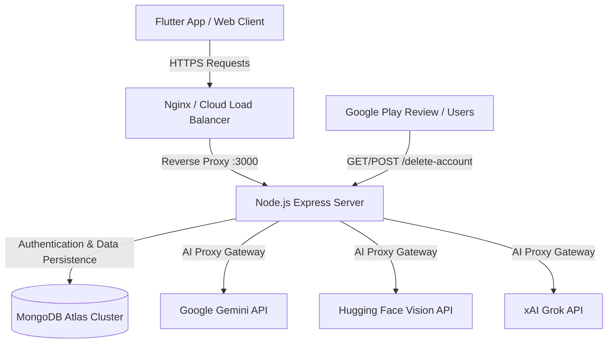

# 🚀 SpryFlora Backend — Production Deployment Blueprint

This document provides a comprehensive, production-grade deployment guide for the **SpryFlora REST API & AI Proxy Backend** (`spryflora_backend`).

---

## 📐 1. System Architecture Overview



- **Runtime**: Node.js v20 (ES Modules)
- **Framework**: Express.js with Helmet security, Cors, & Rate Limiting
- **Database**: MongoDB (Mongoose ODM v8)
- **Special Endpoints**:
  - `/health` & `/ready` health probe endpoints
  - `/delete-account` server-rendered HTML portal for Google Play account deletion policy compliance
  - `/ai/*` authenticated server-side AI proxy gateway

---

## 🔑 2. Environment Configuration Matrix

Create a `.env` file in production using the template below:

| Environment Variable | Required | Default Value | Description |
| :--- | :---: | :--- | :--- |
| `NODE_ENV` | **Yes** | `production` | Execution environment (`production`, `development`, `test`) |
| `PORT` | No | `3000` | Port for Express server |
| `MONGODB_URI` | **Yes** | `mongodb://localhost:27017/spryflora_db` | MongoDB connection string (Atlas or self-hosted) |
| `JWT_SECRET` | **Yes** | *None* | High-entropy secret for signing JWT bearer tokens |
| `JWT_EXPIRES_IN` | No | `14d` | JWT token validity window |
| `GEMINI_API_KEY_1` | **Yes** | *None* | Primary Gemini key (Photo Analysis & Leaf Diagnostics) |
| `GEMINI_API_KEY_2` | **Yes** | *None* | Secondary Gemini key (Flora AI Q&A Chatbot) |
| `GEMINI_API_KEY` | Optional | *None* | Fallback Gemini API Key |
| `HUGGINGFACE_API_KEY` | Optional | *None* | Key for Hugging Face ViT model inference |
| `GROK_API_KEY` | Optional | *None* | Key for xAI Grok reasoning model |
| `CORS_ORIGINS` | **Yes** | `*` | Allowed CORS origins (e.g., `https://spryflora.com,http://localhost:8080`) |

---

## 🌐 3. Cloud Deployment Options

### Option A: Render.com (Recommended PaaS Setup)

Fill in the Render **New Web Service** creation form with the exact settings below:

| Render Form Field | Exact Value / Selection |
| :--- | :--- |
| **Repository** | `TheOrionGD/SpryFlora` |
| **Name** | `spryflora-backend` |
| **Project** | `College-Projects` *(or select your existing project)* |
| **Environment** | `Production` |
| **Language** | `Node` |
| **Branch** | `main` |
| **Region** | `Singapore (Southeast Asia)` *(or Oregon US West)* |
| **Root Directory** | `spryflora_backend` |
| **Build Command** | `npm ci` |
| **Start Command** | `npm start` |
| **Instance Type / Plan** | Free (`$0 / month` - 0.1 CPU, 512 MB RAM) |

### Option B: DigitalOcean / AWS VPS (Ubuntu 22.04 + PM2 + Nginx)

#### 1. Setup Node.js & PM2
```bash
sudo apt update && sudo apt install -y nodejs npm nginx certbot python3-certbot-nginx
sudo npm install -g pm2

cd /var/www/spryflora_backend
npm ci --only=production
```

#### 2. Start PM2 Process
```bash
pm2 start src/server.js --name "spryflora-backend"
pm2 save
pm2 startup
```

#### 3. Nginx Reverse Proxy & SSL Configuration
Create `/etc/nginx/sites-available/spryflora-backend`:
```nginx
server {
    server_name api.spryflora.com;

    location / {
        proxy_pass http://localhost:3000;
        proxy_http_version 1.1;
        proxy_set_header Upgrade $http_upgrade;
        proxy_set_header Connection 'upgrade';
        proxy_set_header Host $host;
        proxy_cache_bypass $http_upgrade;
        proxy_set_header X-Real-IP $remote_addr;
        proxy_set_header X-Forwarded-For $proxy_add_x_forwarded_for;
        proxy_set_header X-Forwarded-Proto $scheme;
    }
}
```

Enable site & SSL Certificate:
```bash
sudo ln -s /etc/nginx/sites-available/spryflora-backend /etc/nginx/sites-enabled/
sudo nginx -t && sudo systemctl reload nginx
sudo certbot --nginx -d api.spryflora.com
```

---

## 📱 4. Connecting Flutter Frontend to Production Backend

Once deployed, update the Flutter production build variable or config:

```bash
# Build APK with Production Backend URL
flutter build apk --release --dart-define=BACKEND_BASE_URL=https://api.spryflora.com
```

### Google Play Console Submission Link
- Provide the public URL to Google Play Console under **App Content -> Account Deletion**:
  - `https://api.spryflora.com/delete-account`

---

## ✅ 5. Health & Verification Checklist

- [x] Test Health Probe: `curl https://api.spryflora.com/health` (Returns `status: ok`)
- [x] Test Database Readiness: `curl https://api.spryflora.com/ready` (Returns `ready: true`)
- [x] Test Account Deletion HTML Portal: Visit `https://api.spryflora.com/delete-account` in browser
- [x] (Optional) Species Database Seed: Run `npm run seed` if default plant species catalog seeding is desired
- [x] Enforce SSL/TLS & CORS rules
